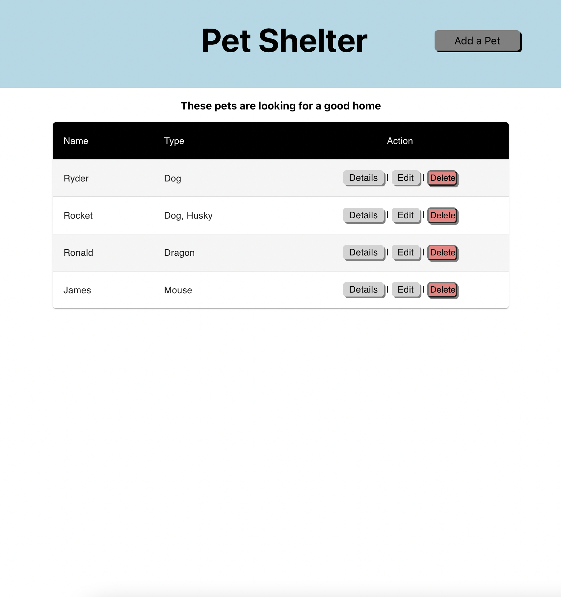
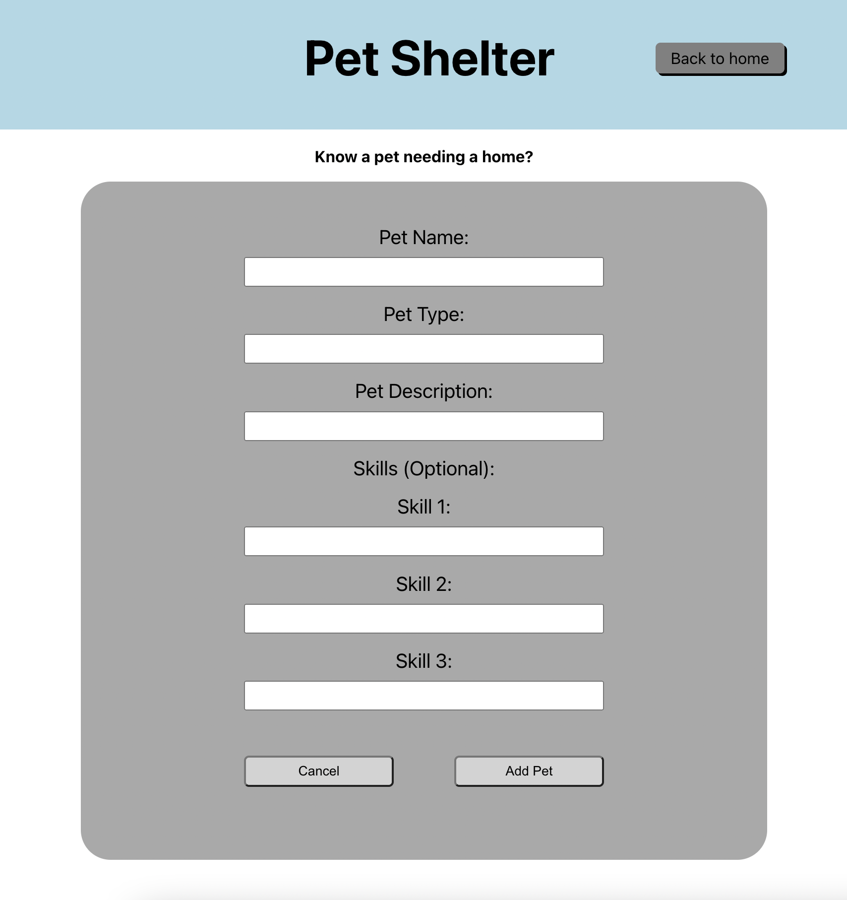
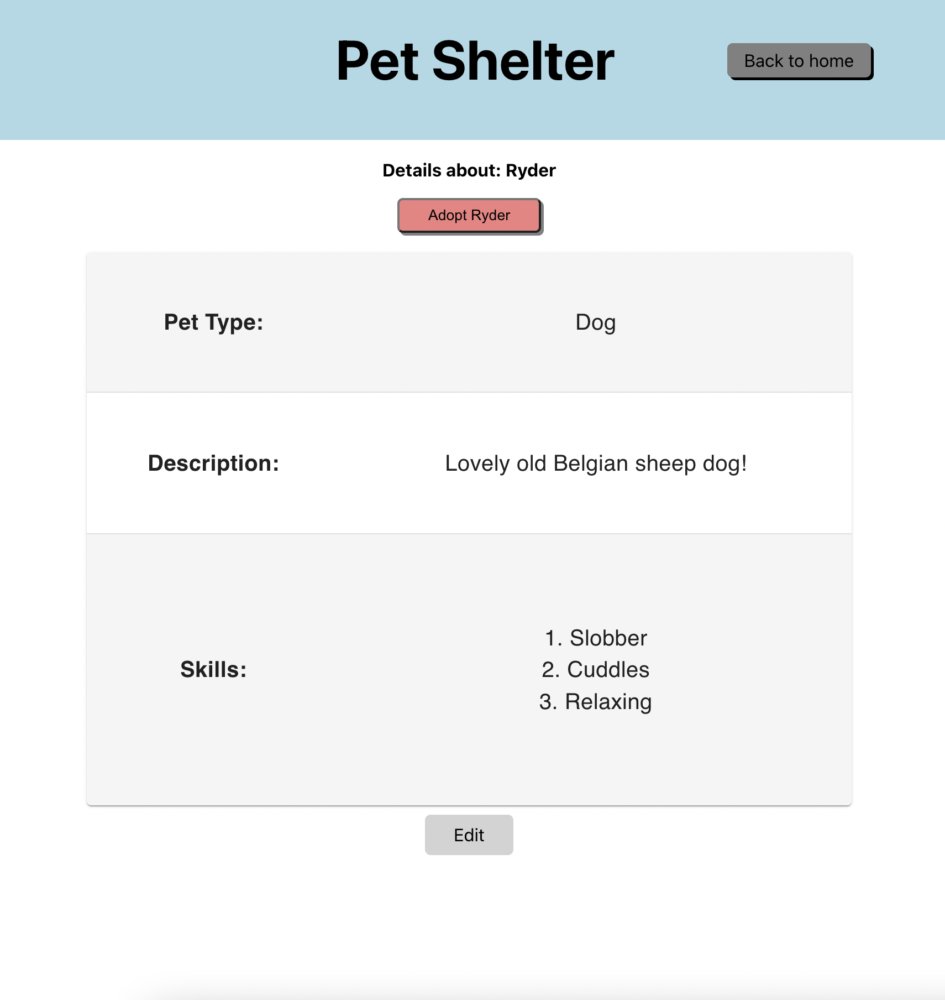
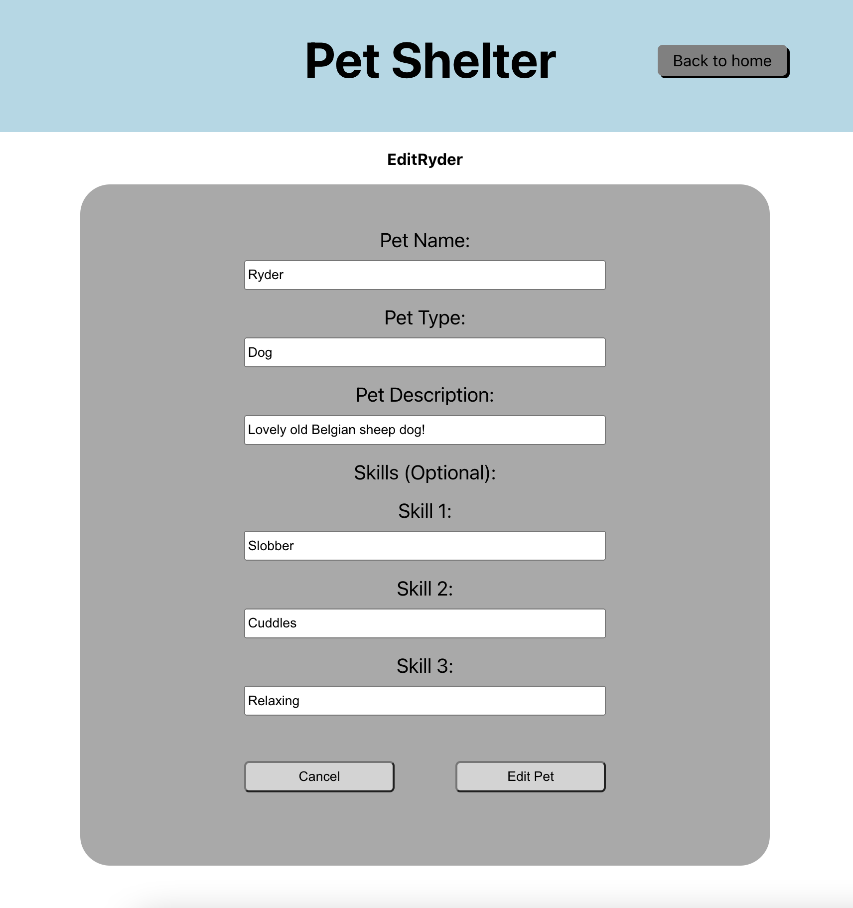

<h1 align='center'>Pet Shelter</h1>

A Full-Stack MERN CRUD Application for Finding and Creating entries for new animals needing a home

### Features

- Responsive React front-end utilizing Materials-UI library for User Experience
- Express.js backend with REST api implementation
- MongoDB connection to Mongoose Database with back-end validations

### Summary

This application was built to help manage loacl animals needing homes. It was built so that User's could register pets that they knew needed homes in the hope for the community to help adopt!

- Create a new entry for an animal needing a new home
    - Only creators can edit or take-down listings manually
    - Adopt a pet on their display page to take them home!

- Use locally
    - Know an area with pets needing re-homing? Clone this repository and use it yourself!
    - Just follow the instructions down below and get yourself set uo and started!

### Photos

- Project Main Page

- Create Form

- Pet Display Page

- Pet Edit Page

### How to Run Locally

- Instructions Coming Soon....
